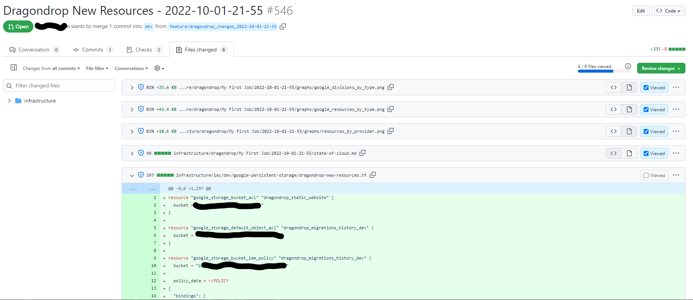
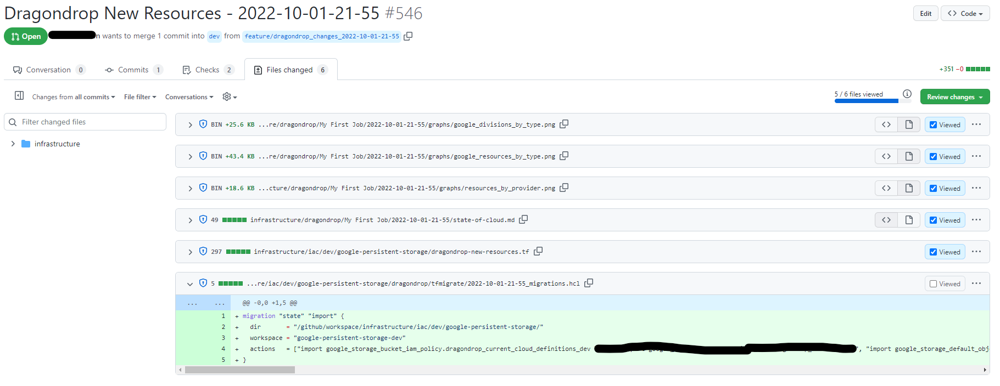
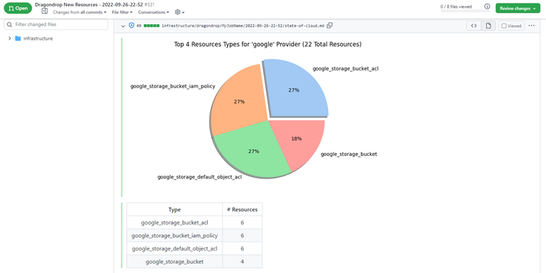

# Job Output

Note that "external resource" refers to a cloud resource that is is outside of Terraform control but living within your public cloud.

### New Terraform Code for External Resources

Each identified external resource has Terraform code generated for it and placed into the directory associated with the workspace that dragondrop has identified as most appropriate for the resource. This new Terraform code is generated in a file called "dragondrop.tf", allowing you to take the configuration and place it within your organized Terraform files with desired syntax modifications (modules, loops, etc.)

<figure><figcaption>
Automated PR from dragondrop, example of new Terraform code generated for external resources.
</figcaption></figure>

### Migration Statements for Importing Resources

Each identified external resource also has a matching state migration statement to import cloud resources generated within the Pull Request. This allows you to store all resource imports as code within your VCS instead of running state migration commands arbitrarily and without record through the CLI.

<figure><figcaption>
Automated PR from dragondrop, example of generated migration statements to import external resources.
</figcaption></figure>

### Visualization of the Current State of External Resources

Each Pull Request outputs visualizations of the current state of resources outside of Terraform control in your environment. These visualizations are output directly to your VCS and are in a markdown file.

<figure><figcaption>
Example of markdown resource visualizations.
</figcaption></figure>
