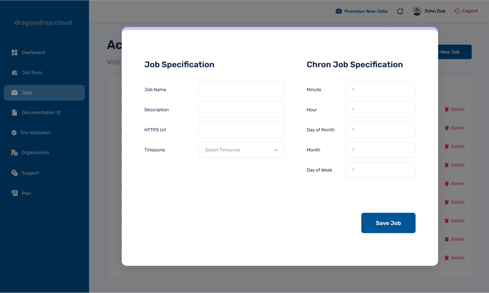

# Creating a Job

Once on the dragondrop web application, simply navigate to the "Jobs" tab, select "Make New Job" in the top right corner, and complete the needed information for your job. In particular, this includes completing information on the job's chron-schedule, as well as the endpoint where requests to trigger the job need to be sent.

<figure><figcaption>
Example of Job Creation within the Web Application
</figcaption></figure>
