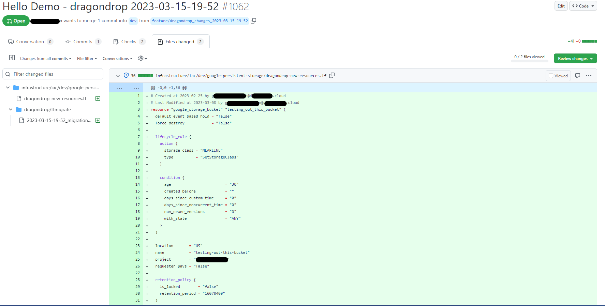

# Job Output

Note that "external resource" refers to a cloud resource that is outside of Terraform control but living within your public cloud.

### New Terraform Code for External Resources

Each identified external resource has Terraform code generated for it and placed into the directory associated with the workspace that dragondrop has identified as most appropriate for the resource. This new Terraform code is generated in a file called "dragondrop.tf", allowing you to take the configuration and place it within your organized Terraform files with desired syntax modifications (modules, loops, etc.). At the top of each resource is information on the Cloud Actor who created and most recently modified the resource.

<figure><figcaption>
New Terraform Code for external resources, along with the service principals and users that created the resources in the first place.
</figcaption></figure>

### Migration Statements for Importing Resources

Each identified external resource also has a matching state migration statement to import cloud resources generated within the Pull Request. This allows you to store all resource imports as code within your VCS instead of running state migration commands arbitrarily and without record through the CLI.

<figure><figcaption>
Automated PR from dragondrop, example of generated migration statements to import external resources.
</figcaption></figure>

### State of Cloud Report and Cloud Actor Identification

Each Pull Request outputs via a PR comment a "State of Cloud Report" which provides a high level summary of the drifted and new-to-Terraform resources identified by dragondrop. It also outputs a summary of the Cloud Actors that made changes outside of your Terraform workflow, allowing you to close the loop on Terraform drift.

<figure><figcaption>
Surfaced Cloud Actors responsible for changes outside of Terraform control.
</figcaption></figure>
