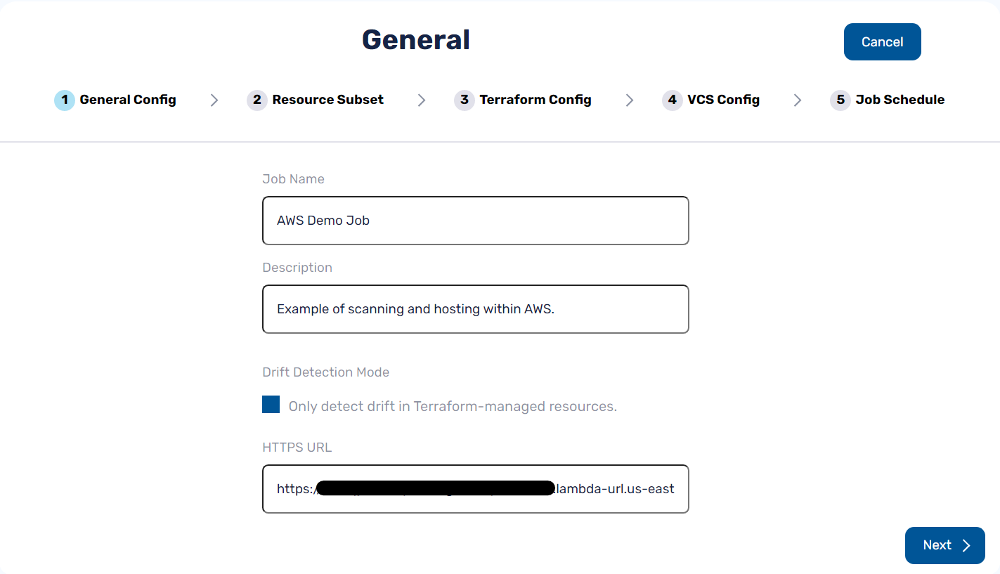

# Managed Drift Only Mode

Many organizations settle on a single IaC tool, and work to codify everything using that tool. dragondrop enables [cloud codification](job-output.md#new-terraform-code-for-external-resources) for Terraform in a highly-automated process.

Some organizations, however, use different IaC tools to manage different parts of their infrastructure. This may be due to a variety of reasons. Primarily, however, we see organizations with cloud resources that historically have been managed by other tools (think: Azure ARM templates, Cloud Formation, and Ansible).

In such cases, there is good reason not to try and import cloud resources already managed by other tools. [cloud-concierge](https://github.com/dragondrop-cloud/cloud-concierge), for this reason, supports running drift detection only for resources already managed by Terraform.

### Managed Drift Only Mode

Running in Managed-Drift only mode is easy, simply select it in your [Job](what-is-a-job.md)'s configuration:

<figure><figcaption>
Example of Job configuration, selected to only detect drift in Terraform-managed resources.
</figcaption></figure>

