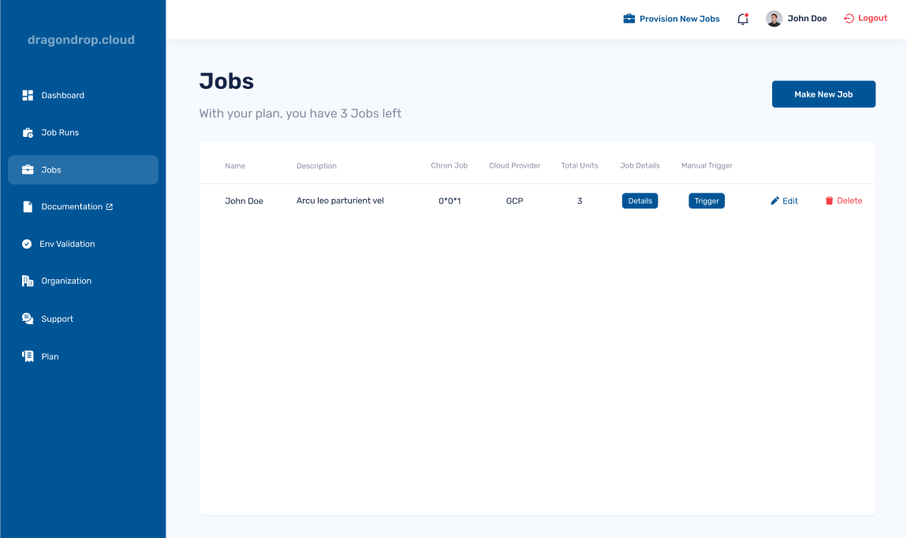

# Running a Job

### Chron Job Schedule

When creating a Job, you can specify a chron job for when the Job should be run. dragondrop will then take care of the rest, triggering your job on the specified schedule.

### Manual Trigger

You can also trigger a job to run outside of its chron schedule via the user interface. Simply navigate to the "Jobs" tab, find the Job that you'd like to run, and select the "Trigger" button.

<figure><figcaption>
Example of viewing a job and the Manual Trigger option in the Web App.
</figcaption></figure>
